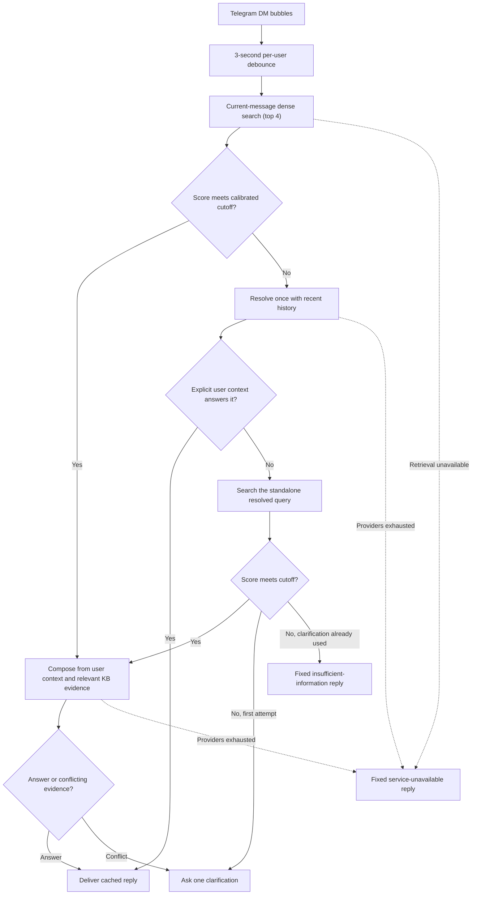

# Context-aware Telegram RAG bot

A single-process Telegram DM bot with in-memory conversational context and calibrated dense retrieval. Every hosted embedding and language model is accessed through OpenRouter. Answers may use facts explicitly provided by the user in recent conversation, while company and platform claims must come from retrieved knowledge chunks.

The current deployment intentionally has no database, Redis, API server, health endpoint, or local ML model.

## Setup

Requires Python 3.11 or newer.

```bash
python3 -m venv .venv
source .venv/bin/activate
pip install -r requirements.txt
cp .env.example .env
```

Set the Telegram token, admin IDs, and `OPENROUTER_API_KEY` in `.env`. OpenRouter serves `openai/text-embedding-3-small` embeddings. A compatible calibrated FAISS index is required at startup.

## Model profiles

`ACTIVE_MODEL_PROFILE` accepts one of two preconfigured names:

- `openrouter`: OpenAI GPT-5 Nano reformulation and composition through OpenRouter, with the `kimi` profile as failover.
- `kimi`: optional Kimi K2.6/K3 reformulation and composition through OpenRouter, with the `openrouter` profile as failover.

All profiles use only the OpenRouter endpoint and key. Model names and routing behavior are fixed in code. Telegram users listed in `TELEGRAM_ADMIN_IDS` may inspect or switch the live profile with `/model` and `/model <profile>`. A batch keeps the profile selected when its debounce completes.

## Build retrieval artifacts

Place approved `.txt` or `.md` documents under `data/raw/knowledge/<category>/`. Every category/document filename pair must exist in `data/taxonomy.json`.

```bash
python -m scripts.ingest --rebuild
```

Ingestion parses document structure, merges small related sections, splits large sections at 500 characters with 50-character overlap, and writes ordered metadata plus a normalized FAISS index under `data/indexes/`. It calibrates the confidence cutoff from `data/evaluation/retrieval_cases.json` and refuses to build when supported and out-of-KB scores overlap. Temporary files are atomically installed only after embedding and calibration succeed.

Rebuild whenever the chunking schema, embedding model, KB, or retrieval evaluation changes. There is no lexical-only fallback.

## Run

```bash
python -m app.main
```

The bot uses Telegram polling and accepts private chats only. Messages arriving within three seconds of the latest bubble are combined into one user turn. Conversation state contains the latest four user/assistant exchanges, expires after 24 hours of inactivity, and is erased on restart.

## Retrieval behavior

The current batch alone is embedded for the first global search:

- A top score at or above the calibrated cutoff goes directly to grounded composition.
- Composition receives the current message, four recent exchanges, and retrieved chunks. It may use explicit user statements for conversational facts and relevant KB chunks for company claims.
- A weak score gets one history-aware resolution step. It may answer directly from explicit user statements or produce a standalone reformulated query for one more dense search.
- A second weak result produces one focused clarification question.
- A clarification reply is searched alone first; when weak, the unresolved query and reply are resolved together for one final search.
- Remaining weak evidence produces fixed insufficient-information text.
- Missing retrieval or exhausted providers produce fixed service-unavailable text.
- Provider retries repeat only the failed API call. Telegram delivery retries reuse the completed reply.

Prior assistant replies and the model's own knowledge are never treated as evidence.

## Request flow



## Tests

```bash
python -m unittest discover -s tests -v
```

Retrieval calibration and other evaluation fixtures remain under `data/evaluation/`. Generated retrieval artifacts and `.env` are ignored by Git.
